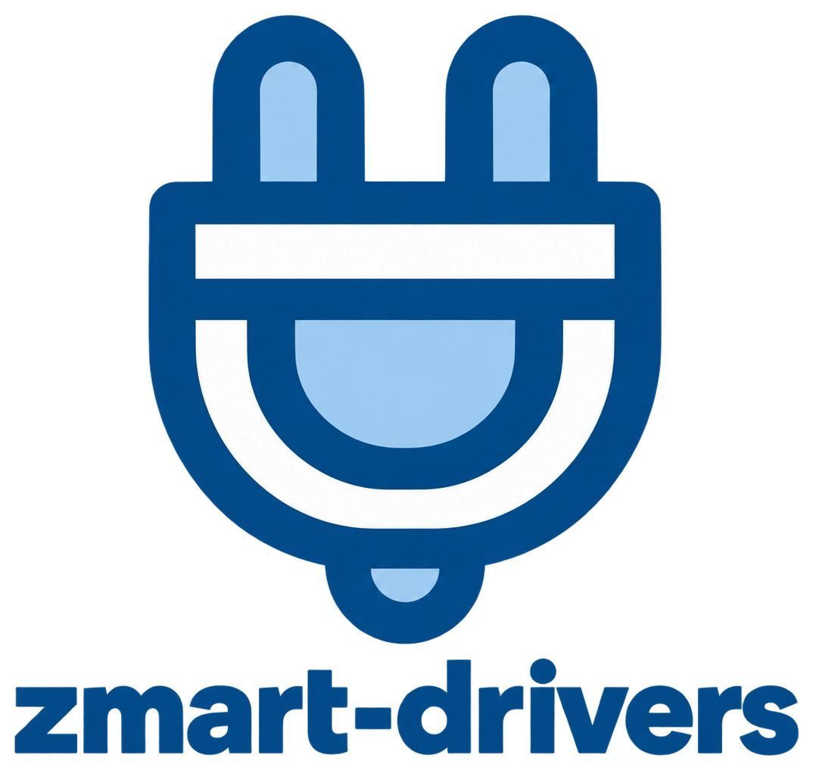

# ZMART Drivers

[](https://www.python.org/downloads/)
[](LICENSE)
[](#status)



The **ZMART Drivers** connect the [ZMART Controller](https://github.com/thomdehoog/ZMART-controller) to real microscopes.
Each driver translates the controller's short list of commands into what one particular microscope understands, through that vendor's own programming interface.
It is part of [**ZMART**](https://github.com/thomdehoog/ZMART-microscopy) (ZMB's Microscopy-Agnostic Research Toolkit), the tools we use for smart microscopy
at the Center for Microscopy and Image Analysis (ZMB), University of Zurich.
<br clear="left"/>

## The Problem

Every microscope speaks its own language: its own programming interface, its own names for
settings, its own habits. A workflow written against one vendor's interface does not run on
another, and it has to take care of that microscope's safety limits and coordinates itself.

## The Solution

A driver takes care of everything that is specific to the instrument, so the workflow does
not have to. A workflow talks only to the [ZMART Controller](https://github.com/thomdehoog/ZMART-controller),
and the driver plugged into it does the rest:

1. **It speaks the vendor's language.** Each microscope has its own interface, its own names
   for settings, and its own habits. The driver hides these behind the controller's commands.
2. **It keeps the microscope safe.** Before any command moves hardware, the driver checks it
   against the limits measured for this microscope, such as how far the stage may travel.
3. **It gives you one coordinate system.** Positions are reported in micrometres, relative to
   a zero point the operator chooses. When you change objectives, the driver uses the
   calibration to keep that zero point on the same spot of your sample.
4. **It confirms what happened.** After a command, the driver reads the microscope back to
   check that it really did what was asked, and says so in its answer.

How these drivers are organised inside, so that the safety behaviour is the same on every
microscope, is described in [the anatomy of a ZMART driver](docs/driver-anatomy.md).

## Drivers in this repository

| Microscope | Vendor interface | Driver | Status |
|---|---|---|---|
| Leica STELLARIS 5 | LAS X Python (CAM) API, Navigator Expert | [`zmart_drivers/leica/stellaris5_y42h93/navigator_expert/`](zmart_drivers/leica/stellaris5_y42h93/navigator_expert/README.md) | **Release candidate `6.0.0rc1`**, not yet released. Tested on the LAS X simulator and a real STELLARIS. Plugs into the controller as a module. See its [release candidate review](zmart_drivers/leica/stellaris5_y42h93/navigator_expert/RELEASE_CANDIDATE_REVIEW.md). |
| Nikon Ti2 | NIS-Elements AR 6.10, a bridge inside NIS | [`zmart_drivers/nikon/nis_elements_6_10/`](zmart_drivers/nikon/nis_elements_6_10/README.md) | Working on the NIS-Elements Ti2 simulator; not yet run on a real microscope. Plugs into the controller as a module. |
| ZEISS (ZEN blue or ZEN core) | ZEN API (`zen_api`, gRPC) | [`zmart_drivers/zeiss/zenapi/`](zmart_drivers/zeiss/zenapi/README.md) | Speaks the published ZEN API, tested against its own fake gateway; not yet run against ZEN itself. Plugs into the controller as a module. |
| mesoSPIM light-sheet | mesoSPIM-control, Remote Scripting | [`zmart_drivers/mesospim/`](zmart_drivers/mesospim/README.md) | Working through Remote Scripting. mesoSPIM-control's own Remote Control is the newer way in; this driver has not moved to it yet. Plugs into the controller as a module. |
| Evident FLUOVIEW FV4000 | Remote Development Kit (RDK) | [`zmart_drivers/evident/`](zmart_drivers/evident/README.md) | Investigation only: a spike that proves the connection against a pretend RDK server. No driver yet, so nothing to plug in. |

The Leica driver is the furthest along. The others work in their own test setups but have
not been reviewed for release.

Each of the four drivers carries a module called `driver.py`. It holds the driver's functions,
one per controller command, which the controller finds by name when you hand it the module (see
the controller's
[guide to plugging in a driver](https://github.com/thomdehoog/ZMART-controller/blob/main/docs/1_plug_in_a_driver/README.md)).
Every connection setting is optional: a driver fills in what you leave out, such as where its
vendor software listens.
Through the controller, every command answers `{"success": ..., "content": ...}`, and
`get_info` describes the microscope in plain words: what each setting means, its unit and its
bounds, and which objectives (or, on the mesoSPIM, which zooms) are fitted, filled in from what
the microscope itself reports.

Each driver also brings its own setup, the steps you take once per microscope before the first
experiment. They store this microscope's configuration (the zero point of the coordinates,
the travel limits and, for the Leica driver, the image orientation and objective calibration)
in the computer's configuration folder, `C:\ProgramData\zmart-microscopy` on Windows, and the
driver loads it every time it connects:

| Driver | Setup, and where it is described |
|---|---|
| Leica | Three notebooks: `limits/notebooks/set_limits.ipynb`, `orientation/notebooks/set_orientation.ipynb` and `calibration/notebooks/calibrate_objective_pair.ipynb`; then the adapter's `set_origin`. See its README, sections 3 to 5. |
| Nikon | The bridge macros (`python -m zmart_drivers.nikon.nis_elements_6_10.bridge.install`) and the adapter's `set_origin`. The travel limits come from NIS-Elements itself. See "Setting it up on the microscope PC" in its README. |
| ZEISS | The ZEN API `config.ini`, the stage limits in `stage_limits.json` (generic defaults are copied there on the first connect and must be replaced), and the adapter's `set_origin`. See "Setting it up on the microscope PC" in its README. |
| mesoSPIM | The Remote Scripting server in mesoSPIM-control, the limits in `stage_limits.json` and `function_limits.json` (bundled defaults until you save your own), and the adapter's `set_origin`. See its [workflow manual](zmart_drivers/mesospim/WORKFLOW.md). |

Drivers are organised by vendor, then by microscope, then by the vendor interface they use:
`zmart_drivers/<vendor>/<microscope>/<interface>/`. A single microscope can therefore have
more than one driver if its vendor offers more than one way in.

## Try it yourself

The drivers need Python 3.11 or newer. Download this repository, open a terminal in its root
folder, and install it with pip. This also installs the ZMART Controller. Add the extra for your
microscope, so that only the packages that driver needs are installed: `leica` for the Leica
driver and `zeiss` for the ZEISS driver; the Nikon and mesoSPIM drivers need nothing extra.

```bash
pip install -e ".[leica]"
```

The ZEISS driver also needs ZEISS's own `zen_api` package, which must match your ZEN version;
its [README](zmart_drivers/zeiss/zenapi/README.md) explains how to install it.

Then import the driver module for your microscope and hand it to the controller:

```python
import zmart_controller
import zmart_drivers.leica.stellaris5_y42h93.navigator_expert.driver as stellaris

zmart_controller.set_instrument(stellaris)
print(zmart_controller.get_info()["content"]["description"])
```

The driver modules of the other drivers are `zmart_drivers.nikon.nis_elements_6_10.driver`,
`zmart_drivers.zeiss.zenapi.driver` and `zmart_drivers.mesospim.driver`. To give an instrument
another name or connection setting, pass a connection dictionary as the second argument, for
example `zmart_controller.set_instrument(stellaris, {"output_root": r"D:\images"})`; each
driver's `driver.py` lists the settings it understands.

The Leica driver runs on the computer that runs LAS X, because it loads Leica's interface
directly into Python. Each driver's README explains its own installation, its setup, and how
to drive the microscope from Python without the controller.

### Status

This repository is a **release candidate**. It collects the drivers that are ready to be
reviewed for release, separately from the rest of ZMART-microscopy. Nothing in it is released
yet. The Leica driver has been tested on the LAS X simulator and on a real STELLARIS, and its
[release candidate review](zmart_drivers/leica/stellaris5_y42h93/navigator_expert/RELEASE_CANDIDATE_REVIEW.md)
lists what must be fixed before release. Please do not leave the Leica driver running
unattended until the high-severity findings in that review are resolved.

The ZMART Controller needs Python 3.11 or newer, so the drivers need it too.

ZMART-microscopy has its own place for a driver's setup steps (`zmart_drivers/setup/`) and a
Leica setup helper (`zmart_adapter/setup.py`). Neither is part of this repository yet; for now
each driver's setup lives in the driver, as listed above.

## Testing

Every driver carries its own offline test suite, which runs without a microscope or vendor
software. Each suite also plugs its driver module into the ZMART Controller and lets the
controller check every answer. Install the test extras, then run the suites from the root
folder of this repository:

```bash
pip install -e ".[leica,zeiss,test]"
pip install -r zmart_drivers/zeiss/zenapi/requirements.txt   # ZEISS's zen_api, for the fake-gateway tests

python zmart_drivers/leica/stellaris5_y42h93/navigator_expert/run_ci.py
python -P -m pytest zmart_drivers/nikon/nis_elements_6_10
python zmart_drivers/zeiss/zenapi/run_ci.py --no-lint
python zmart_drivers/mesospim/run_ci.py
```

The ZEISS suite counts style findings from ruff as failures; `--no-lint` leaves that check out
until its existing findings are fixed. `-P` keeps the folder Python starts in off its search
path, so that a driver folder with a common name, such as `config`, is never imported in place
of another package.

The continuous-integration workflow in `.github/workflows/` runs all four suites on Linux and
Windows, with Python 3.11 and 3.12. Six tests of the Leica suite fail and are known; its
[release candidate review](zmart_drivers/leica/stellaris5_y42h93/navigator_expert/RELEASE_CANDIDATE_REVIEW.md)
explains them (findings T1 to T3).

## Author

Thom de Hoog, Center for Microscopy and Image Analysis (ZMB), University of Zurich
(thom.dehoog@zmb.uzh.ch, thomdehoog@gmail.com).

## License

MIT License. See the [LICENSE](LICENSE) file for details.

## Links

- [ZMART Microscopy](https://github.com/thomdehoog/ZMART-microscopy): the main repository, with the workflows
- [ZMART Controller](https://github.com/thomdehoog/ZMART-controller): the microscope-independent layer these drivers plug into
- [ZMART analysis](https://github.com/thomdehoog/ZMART-analysis): the analysis engine that runs between acquisitions
- [ZMART AI agent](https://github.com/thomdehoog/ZMART-ai-agent): drive any microscope by chatting, through the controller
- [ZMART viewer](https://github.com/thomdehoog/ZMART-viewer): the viewer
- [Center for Microscopy and Image Analysis (ZMB)](https://www.zmb.uzh.ch), University of Zurich
